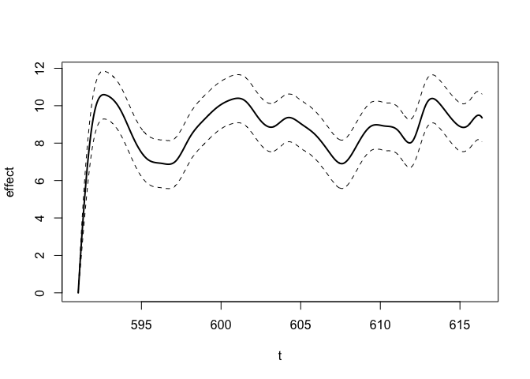
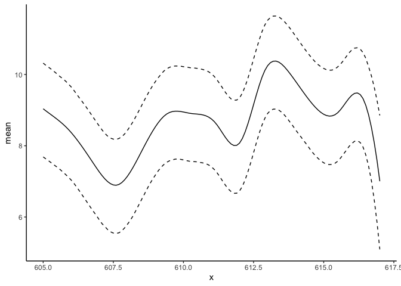
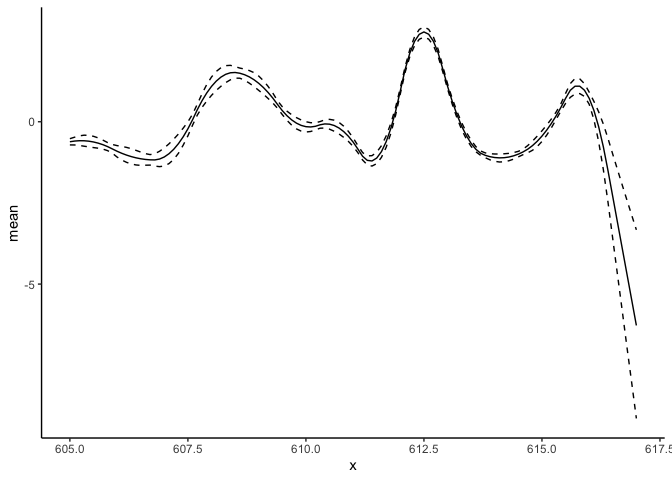
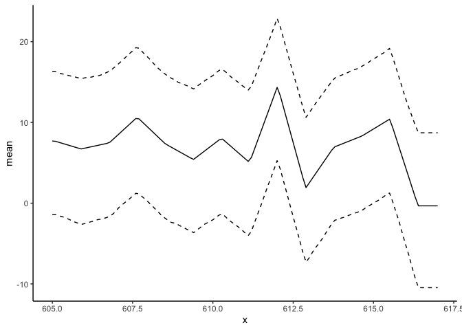

<!-- README.md is generated from README.Rmd. Please edit that file -->

# BayesGP

<!-- badges: start -->
<!-- badges: end -->

The goal of the `BayesGP` package is to efficiently implement
model-based smoothing with the integrated Wiener’s process, within a
variety of Bayesian hierarchical models.

## Installation

You can install the development version of BayesGP from
[GitHub](https://github.com/) with:

``` r
# install.packages("devtools")
devtools::install_github("https://github.com/AgueroZZ/BayesGP")
```

## Example

This is a basic example which shows you how to use `BayesGP` to fit and
analyze some models, we consider the following data set of COVID-19
mortality in Canada, which is available in the package:

``` r
library(BayesGP)
#> Loading required package: Matrix
#> Loading required package: aghq
#> Loading required package: LaplacesDemon
#> Registered S3 method overwritten by 'LaplacesDemon':
#>   method        from
#>   print.laplace aghq
## basic example code
head(covid_canada)
#>         Date new_deaths        t weekdays1 weekdays2 weekdays3 weekdays4
#> 1 2020-03-01          0 591.0323        -1        -1        -1        -1
#> 2 2020-03-02          0 591.0645         1         0         0         0
#> 3 2020-03-03          0 591.0968         0         1         0         0
#> 4 2020-03-04          0 591.1290         0         0         1         0
#> 5 2020-03-05          0 591.1613         0         0         0         1
#> 6 2020-03-06          0 591.1935         0         0         0         0
#>   weekdays5 weekdays6 index
#> 1        -1        -1     1
#> 2         0         0     2
#> 3         0         0     3
#> 4         0         0     4
#> 5         0         0     5
#> 6         1         0     6
```

We can fit a model with $\text{IWP}_3(\sigma)$ prior using the function
`model_fit`:

``` r
fit_result <- model_fit(new_deaths ~ weekdays1 + weekdays2 + weekdays3 + weekdays4 + weekdays5 + weekdays6 +
                          f(smoothing_var = t, model = "IWP", order = 3, k = 30), 
                        data = covid_canada, method = "aghq", family = "Poisson")
```

We can take a look at the posterior summary of this model:

``` r
summary(fit_result)
#> Warning: 'Matrix::..2dge' is deprecated.
#> Use '.dense2g' instead.
#> See help("Deprecated") and help("Matrix-deprecated").
#> There are 38 random effects, but max_print = 30, so not computing their summary information.
#> Set max_print higher than 38 if you would like to summarize the random effects.
#> AGHQ on a 1 dimensional posterior with  4 quadrature points
#> 
#> The posterior mode is: -3.245926 
#> 
#> The log of the normalizing constant/marginal likelihood is: -4322.531 
#> 
#> The covariance matrix used for the quadrature is...
#>            [,1]
#> [1,] 0.07936619
#> 
#> Here are some moments and quantiles for the log precision: 
#>               mean        sd     2.5%    median     97.5%
#> theta(t) -3.271182 0.2785344 -3.87922 -3.268308 -2.760093
#> 
#> Here are some moments and quantiles for the fixed effects: 
#> 
#>               1st Qu.      Median        Mean     3rd Qu.         sd
#> Intercept -5.85009960 -5.39828827 -5.40444709 -4.96610282 0.66061232
#> weekdays1  0.08593199  0.09363400  0.09374558  0.10185204 0.01198239
#> weekdays2  0.07119132  0.07901001  0.07921671  0.08681463 0.01188838
#> weekdays3  0.11915351  0.12664433  0.12672077  0.13428875 0.01150235
#> weekdays4  0.11738449  0.12540111  0.12547251  0.13351978 0.01181344
#> weekdays5  0.04171450  0.05005612  0.05001256  0.05800325 0.01213118
#> weekdays6 -0.16074510 -0.15130102 -0.15125835 -0.14229662 0.01336132
```

We can also see the inferred function $f$:

``` r
plot(fit_result)
```



We can use the `predict` function to obtain the posterior summary of $f$
or its derivative at `new_data`.

For the function $f$:

``` r
library(tidyverse)
#> ── Attaching packages ─────────────────────────────────────── tidyverse 1.3.2 ──
#> ✔ ggplot2 3.4.1      ✔ purrr   0.3.4 
#> ✔ tibble  3.1.8      ✔ dplyr   1.0.10
#> ✔ tidyr   1.2.1      ✔ stringr 1.4.1 
#> ✔ readr   2.1.2      ✔ forcats 0.5.2 
#> ── Conflicts ────────────────────────────────────────── tidyverse_conflicts() ──
#> ✖ tidyr::expand()  masks Matrix::expand()
#> ✖ dplyr::filter()  masks stats::filter()
#> ✖ dplyr::lag()     masks stats::lag()
#> ✖ tidyr::pack()    masks Matrix::pack()
#> ✖ purrr::partial() masks LaplacesDemon::partial()
#> ✖ tidyr::unpack()  masks Matrix::unpack()
predict_f <- predict(fit_result, variable = "t", newdata = data.frame(t = seq(from = 605, to = 617, by = 0.1)))
predict_f %>% ggplot(aes(x = x)) + geom_line(aes(y = mean), lty = "solid") +
  geom_line(aes(y = plower), lty = "dashed") +
  geom_line(aes(y = pupper), lty = "dashed") +
  theme_classic()
```



For the first derivative:

``` r
predict_f1st <- predict(fit_result, variable = "t", newdata = data.frame(t = seq(from = 605, to = 617, by = 0.1)), degree = 1)
predict_f1st %>% ggplot(aes(x = x)) + geom_line(aes(y = mean), lty = "solid") +
  geom_line(aes(y = plower), lty = "dashed") +
  geom_line(aes(y = pupper), lty = "dashed") +
  theme_classic()
```



For the second derivative:

``` r
predict_f2nd <- predict(fit_result, variable = "t", newdata = data.frame(t = seq(from = 605, to = 617, by = 0.1)), degree = 2)
predict_f2nd %>% ggplot(aes(x = x)) + geom_line(aes(y = mean), lty = "solid") +
  geom_line(aes(y = plower), lty = "dashed") +
  geom_line(aes(y = pupper), lty = "dashed") +
  theme_classic()
```


